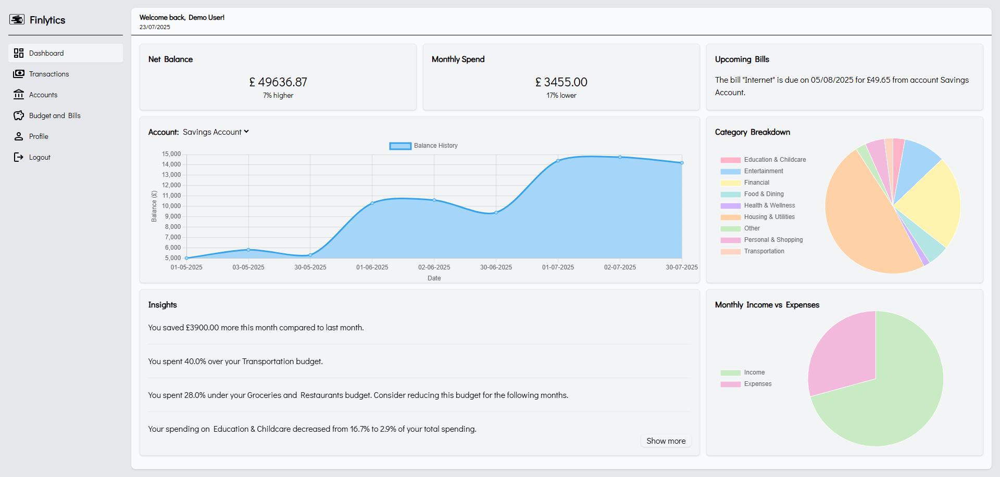
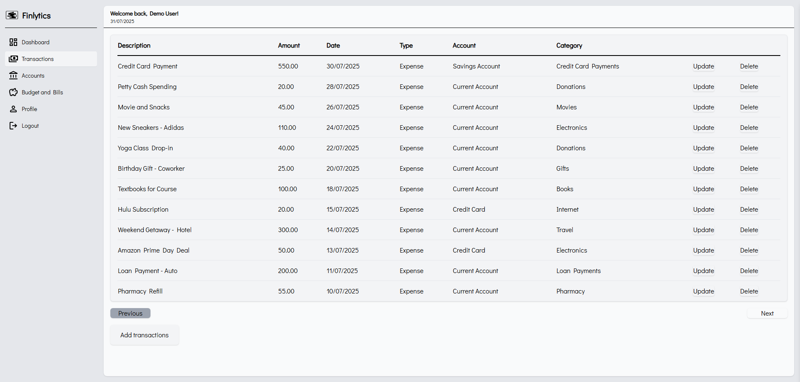
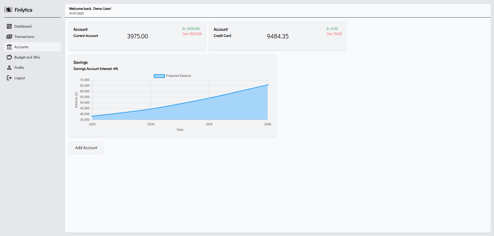
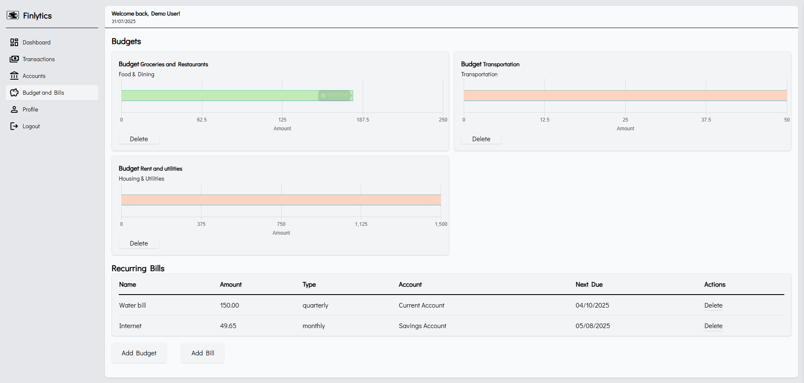

# Personal Finance Webapp
A full-stack personal finance management tool that helps users understand and improve their financial health through rich data visualisation, automated insights, and powerful transaction handling — all in a secure environment.

---

## Table of Contents

- [Features](#features)
- [Tech Stack](#tech-stack)
- [Code Snippets](#code-snippets)
- [Screenshots](#screenshots)
- [Purpose](#purpose)
- [Note](#snote)

---

## Features

### User Authentication
- Secure sign-up and login
- All passwords hashed with industry standards

### Dashboard with Real-Time Insights
- Net balance overview
- Upcoming bills
- Visual graphs for spending and income patterns
- Auto-generated financial insights

### Transactions
- Sortable, paginated transaction list
- Excel file upload for batch imports
- Auto-categorisation with a custom ML model

### Accounts Management
- Normal and savings accounts
- Savings include 15-year compound interest projections

### Budgets & Bills
- Set one budget per category
- Track and visualise recurring bills

### Profile
- View and manage user profile and personal details

---

## Tech Stack

- **Frontend**: React.js, TailwindCSS, Chart.js
- **Backend**: Django REST Framework
- **Database**: PostgreSQL
- **Authentication**: JWT (JSON Web Tokens)
- **ML**: Scikit-learn for transaction categorisation
- **File Upload**: Pandas for Excel processing

---

## Code Snippets
### Adding transactions:
This is the API endpoint for adding new transactions to the database

```python
@api_bp.route("/transactions/add/single", methods=["POST"])
@login_required
def transaction_add():
    new_transaction = request.form.to_dict()
    try:
        result = add_transaction(new_transaction)
        return jsonify({"status": "Transaction has been added successfully.", "inserted": result}), 200
    except ValueError as ve:
        logging.error("An error occured:\n%s", traceback.format_exc())
        return jsonify({"error": str(ve)}), 400
    except Exception as e:
        logging.error("An unexpected error occured:\n%s", traceback.format_exc())
        return jsonify({"error": "Unexpected server error."}), 500
```

This helper function handles the core transaction adding logic. It converts input types, predicts the category using an ML model, updates account balances and budgets, and safely commits the transaction to the database.

```python
def add_transaction(new_transaction: Dict[str, Any]) -> Dict[str, Any]:
    # Checking required fields
    check_transaction_required_fields(new_transaction)
    #Handling type conversions
    new_transaction["amount"] = Decimal(new_transaction["amount"])
    new_transaction["date"] = datetime.strptime(new_transaction["date"], "%d/%m/%Y %H:%M")

    # Getting correct account id from account name and updating account table
    account: int = get_or_create_account(new_transaction["account_name"])
    new_transaction["account_id"] = account._id

    # Predicting category
    category_name: str = predict_category(new_transaction["description"], new_transaction["transaction_type"], new_transaction["amount"])

    # Getting correct category id from category name
    new_transaction["category_id"] = get_category(category_name)
    
    # Updating account amount
    update_account_balance(account._id, new_transaction["amount"], new_transaction["transaction_type"])

    # Update any relevent budget
    if new_transaction["transaction_type"] == "Expense":
        update_budget(new_transaction["amount"], category_name)

    # Add current user
    new_transaction["user_id"] = int(current_user.get_id())
        
    # Sanitising and creating a model instance by unpacking
    new_transaction.pop("account_name", None)
    sanitised_transaction: Dict[str, Any] = sanitise_model_dict(new_transaction, Transaction)
    unpacked_transaction = Transaction(**sanitised_transaction)

    try:
        db.session.add(unpacked_transaction)
        db.session.commit()
        return sanitised_transaction
    except Exception as e:
        db.session.rollback()
        raise ValueError("Failed to add transaction to database.") from e
```

### Predicting the category
Predict the most likely sub-category for a given transaction using a two-stage ML pipeline.
```python
def predict_category(t_description: str, t_type: str, t_amount: Decimal) -> str:
    try:
        # preprocess_text is a custom function that processes input text by lowercasing, removing punctuation,
        # stripping stopwords, and lemmatizing.
        combined_data1: str = preprocess_text(f"{t_description} {t_type}")
        X_text1 = vectoriser_one.transform([combined_data1])

        amount_value = float(t_amount)
        amount_sparse = csr_matrix([[amount_value]])

        # Predicting the parent category based on features
        X_parent_features = hstack([X_text1, amount_sparse])
        prediction_parent = model_one.predict(X_parent_features)

        combined_data2: str = (f"{combined_data1} {preprocess_text(prediction_parent[0])}")
        X_text2 = vectoriser_two.transform([combined_data2])

        # Predicting sub category after adding parent category to featuers
        X_sub_features = hstack([X_text2, amount_sparse])
        prediction = model_two.predict(X_sub_features)

        return prediction[0]
    except Exception as e:
        logging.exception("Error during category prediction")
        raise
```

### Re-useable sanitise models function
Filters out keys from input_dict that are not columns in the given SQLAlchemy model. Useful for safely passing dynamic user input to model constructors.
```python
def sanitise_model_dict(input_dict: Dict[str, any], model: Type[DeclarativeMeta]) -> Dict[str, any]:
    valid_keys = {
        column.name
        for cls in model.__mro__
        if hasattr(cls, '__table__')
        for column in cls.__table__.columns
    }
    return {key: value for key, value in input_dict.items() if key in valid_keys}
```

### API endpoint to get the user's net balance
This calls two helper functions that calculate the user's current net balance as well as the change from last month for display on the dashboard card

```python
@api_bp.route("/accounts/netbalance", methods=["GET"])
@login_required
def get_net_balance():
    amount: float = calculate_net_balance() or 0.0
    change: str = net_balance_change() or 0.0

    return jsonify({"amount": amount , "change": change}), 200
```

The response would be something like this:
```json
{
  "amount": 1873.52,
  "change": "10% higher"
}
```

---

## Screenshots


### Secure register form


### Dashboard


### Transactions


### Accounts


### Budgets and Bills


---

## Purpose

This project was built as a hands-on way to deepen my understanding of full-stack development. I wanted to challenge myself to design and implement a complete system. Beyond learning technical tools, I aimed to improve my ability to design for real-world use cases. Balancing usability, performance and maintainability. This project reflects not only what I’ve learned so far but how I approach problem solving and system design.
---

## Note

If you see any mistakes or things that could be improved, don't hesitate to send me a message.
