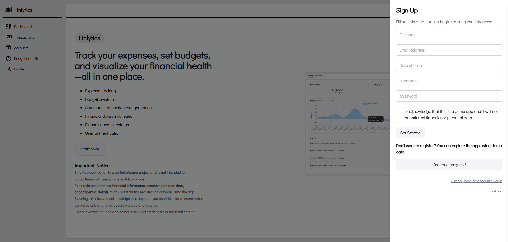

# Fintech Webapp
Fullstack finance platform with ML-powered transaction categorisation, Redis-backed performance optimisation and a modular Flask + VanillaJS architecture.

---

## Table of Contents

- [Core Engineering Highlights](#core-engineering-highlights)
- [System Architecture](#system-architecture)
- [Features](#features)
- [Key Engineering Decisions](#key-engineering-decisions)
- [Code Examples](#code-examples)
- [Screenshots](#screenshots)
- [Tech Stack](#tech-stack)
- [Purpose](#purpose)

---

## Core Engineering Highlights
- Two-stage RandomForest ML pipeline combining TF-IDF text features + binned amount features for high-accuracy category + subcategory prediction.
- 200% faster dashboard rendering through targeted Redis caching of insight computations.
- Performance-driven refactor replacing Pandas with native Python after benchmarks showed a 35x speed improvement on per-user datasets.
- Atomic transaction pipeline updating accounts, budgets, ML categorisation, and balances in a single consistent code path.
- Separation of concerns via distinct layers: routes, services, ML pipeline, data access, and presentation.
- Custom DOM architecture (no frontend frameworks) handling state updates, table rendering, filtering, and Chart.js updates at scale.
- Test coverage focused on critical paths: authentication, transaction logic, insights, and prediction code.

---

## System Architecture
```
                          ┌─────────────────────────────┐
                          │        Frontend             │
                          │  VanillaJS / Tailwind /     │
                          │        Chart.js             │
                          └─────────────┬───────────────┘
                                        │
                                 REST JSON API
                                        │
                   ┌────────────────────┴────────────────────┐
                   │                 Backend                 │
                   │ Flask + SQLAlchemy + Flask-Migrate      │
                   │  Routes → Services → Data Access        │
                   └───────────────┬──────────────┬──────────┘
                                   │              │
                                   │              │
                     ┌─────────────┴──────┐┌──────┴───────────┐
                     │ ML Pipeline        ││  Caching Layer   │
                     │ Two-stage RF       ││  Redis           │
                     │ Vectorisers(TF-IDF)││                  │
                     └─────────────┬──────┘└──────────────────┘
                                   │            
                         ┌─────────┴────────┐ 
                         │   PostgreSQL     │ 
                         │   Persisted Data │  
                         └──────────────────┘

```
---
## Features

### Dashboard
- Net balance
- Upcoming recurring bills
- Line graph of account balances over time
- Category spending pie chart
- Spending vs income
- Automatically surfaced financial insights

### Transactions
- Full CRUD
- Sortable, paginated lists
- Excel import (Pandas used here intentionally)
- ML-powered auto-categorisation
- Budget-aware expense updates

### Accounts
- Normal and savings accounts
- 15-year compound interest projections

### Budgets & Bills
- One budget per category
- Recurring bill management

### Profile
- Manage personal information

---

## Key Engineering Decisions

### 1. ML Pipeline

Why RandomForest over Naive Bayes?
Naive Bayes performed well on training data but collapsed on real-world text noise.
RandomForest + amount features increased subcategory accuracy significantly.

Pipeline architecture:
- Stage 1: Predict parent category (TF-IDF + amount).
- Stage 2: Predict subcategory using enriched input (text + predicted parent).
- Sparse matrix stacking to combine numeric + text features.
- Prevented data leakage by splitting before parent prediction.

### 2. Redis Caching

Problem: Dashboard insights were heavy due to per-request aggregation.
Solution: Cache insight computations keyed by user ID.
Outcome: ~200% faster dashboard load time.

### 3. Pandas vs Native Python

Observation: Per-user datasets (post-SQL filtering) were small.

Benchmark results:
- Native Python: ~35,000 ops/sec
- Pandas: ~1,000 ops/sec

Conclusion: Remove Pandas from insight generation and use it only for Excel import.

### 4. Manual DOM Architecture

Chose to avoid React deliberately to deepen frontend fundamentals.

Built:
- State management via JS objects
- Table rendering from scratch
- Event delegation patterns
- Chart.js data binding and update lifecycle

Result: Strong understanding of browser rendering costs and where frameworks help.

### 5. Architecture & Separation of Concerns

The application is divided into clean layers:
- Routes (HTTP endpoint definitions)
- Services (business logic)
- ML (categorisation pipeline)
- Data access (SQLAlchemy models, queries)
- Templates / JS (presentation)

Refactoring into these boundaries prevented divergence and ensured testability.

---

## Code Examples

### Add Transaction (Endpoint)
```
POST /transactions/add/single
```
Handles:
- User input validation
- Type conversion
- ML categorisation
- Linked updates: accounts, budgets
- Atomic DB commit

```python
@api_bp.route("/transactions/add/single", methods=["POST"])
@login_required
def transaction_add():
    new_transaction = request.form.to_dict()
    try:
        result = add_transaction(new_transaction)
        return jsonify({"status": "Transaction has been added successfully.", "inserted": result}), 200
    except ValueError as ve:
        logging.error("An error occured:\n%s", traceback.format_exc())
        return jsonify({"error": str(ve)}), 400
    except Exception as e:
        logging.error("An unexpected error occured:\n%s", traceback.format_exc())
        return jsonify({"error": "Unexpected server error."}), 500
```

### Predicting the category
Predict the most likely sub-category for a given transaction using a two-stage ML pipeline.
```python
def predict_category(t_description: str, t_type: str, t_amount: Decimal) -> str:
    try:
        # preprocess_text is a custom function that processes input text by lowercasing, removing punctuation,
        # stripping stopwords and lemmatizing.
        combined_data1: str = preprocess_text(f"{t_description} {t_type}")
        X_text1 = vectoriser_one.transform([combined_data1])

        amount_value = float(t_amount)
        amount_sparse = csr_matrix([[amount_value]])

        # Predicting the parent category based on features
        X_parent_features = hstack([X_text1, amount_sparse])
        prediction_parent = model_one.predict(X_parent_features)

        combined_data2: str = (f"{combined_data1} {preprocess_text(prediction_parent[0])}")
        X_text2 = vectoriser_two.transform([combined_data2])

        # Predicting sub category after adding parent category to featuers
        X_sub_features = hstack([X_text2, amount_sparse])
        prediction = model_two.predict(X_sub_features)

        return prediction[0]
    except Exception as e:
        logging.exception("Error during category prediction")
        raise
```

### Re-useable sanitise models function
Filters out keys from input_dict that are not columns in the given SQLAlchemy model. Useful for safely passing dynamic user input to model constructors.
```python
def sanitise_model_dict(input_dict: Dict[str, any], model: Type[DeclarativeMeta]) -> Dict[str, any]:
    valid_keys = {
        column.name
        for cls in model.__mro__
        if hasattr(cls, '__table__')
        for column in cls.__table__.columns
    }
    return {key: value for key, value in input_dict.items() if key in valid_keys}
```

### API endpoint to get the user's net balance
This calls two helper functions that calculate the user's current net balance as well as the change from last month for display on the dashboard card

```python
@api_bp.route("/accounts/netbalance", methods=["GET"])
@login_required
def get_net_balance():
    amount: float = calculate_net_balance() or 0.0
    change: str = net_balance_change() or 0.0

    return jsonify({"amount": amount , "change": change}), 200
```

The response would be something like this:
```json
{
  "amount": 1873.52,
  "change": "10% higher"
}
```

---

## Testing Strategy

Focused on high-leverage paths:
- Authentication
- Transaction creation logic
- Budget updates
- Account balance updates
- Insight computation
- Categorisation functions

Goal: Catch regressions early and ensure reliability of critical flows.

---

## What I Learned
- Importance of clear architectural boundaries as the codebase grows.
- When to trade simplicity for performance (e.g., Redis, Native Python).
- How real-world data breaks naive ML models and how to build more robust pipelines.
- How to manage UI complexity without framework abstractions.

---

## Future Improvements
- Background job queue for ML prediction to avoid blocking UI during large imports
- Notifications system (email or push)
- Improve mobile responsiveness
- Migrate to PostgreSQL
- Add materialised views for insight generation
- Extend caching with invalidation rules

---

## Screenshots


### Secure register form


### Dashboard


### Transactions


### Accounts


### Budgets and Bills


---

## Tech Stack

- **Frontend**: VanillaJS, TailwindCSS, Chart.js
- **Backend**: Flask, Python
- **Database**: PostgreSQL
- **Authentication**: JWT (JSON Web Tokens)
- **ML**: Scikit-learn for transaction categorisation
- **File Upload**: Pandas for Excel processing

---

## Purpose

This project was built as a hands-on way to deepen my understanding of full-stack development. I wanted to challenge myself to design and implement a complete system. Beyond learning technical tools, I aimed to improve my ability to design for real-world use cases. Balancing usability, performance and maintainability. This project reflects not only what I’ve learned so far but how I approach problem solving and system design.
---
